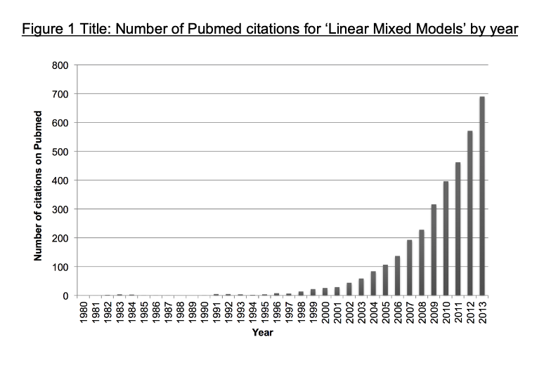
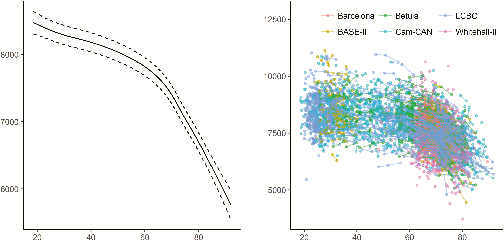
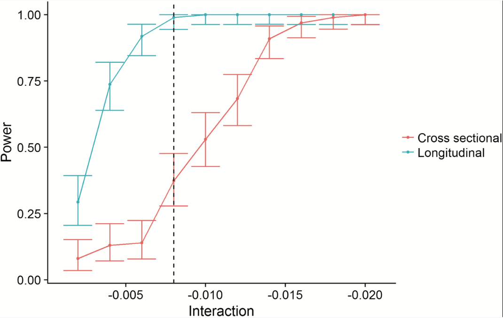
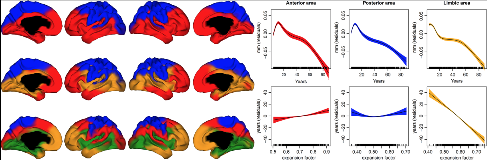
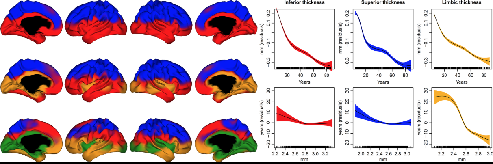
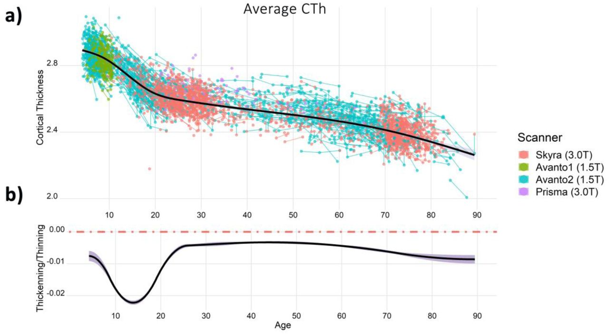
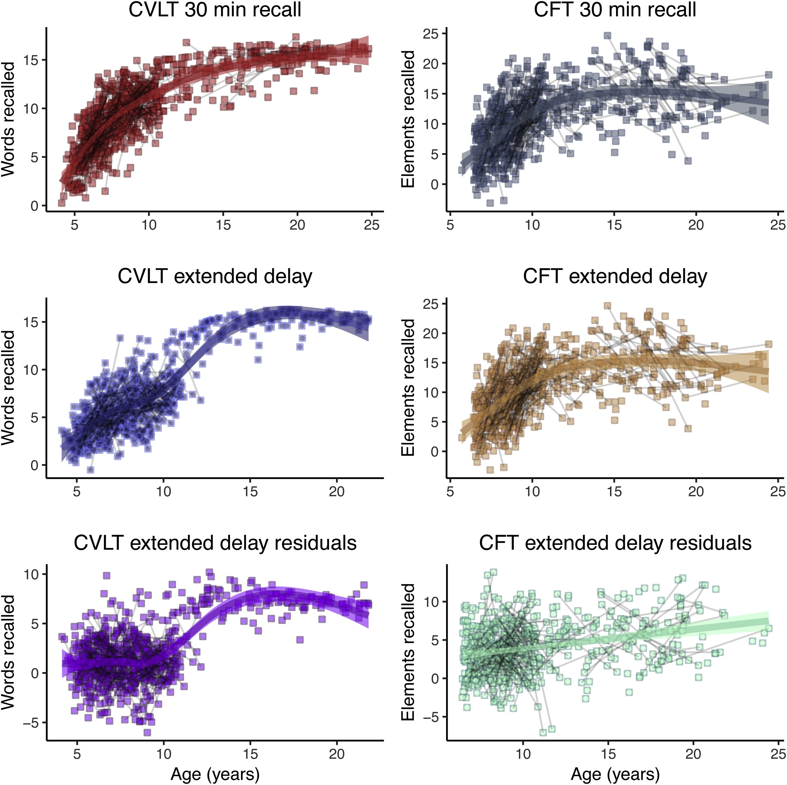
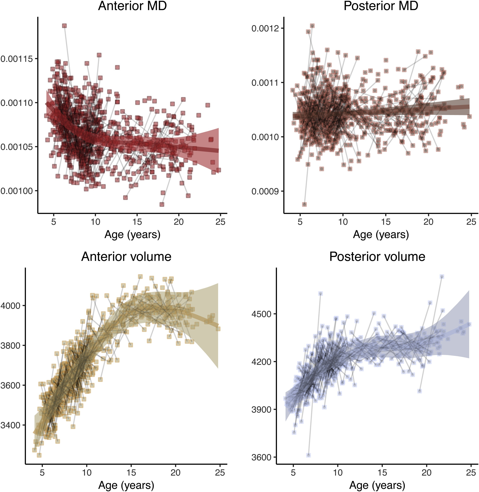
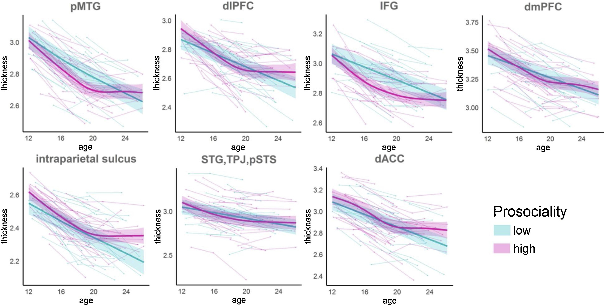

  
```{r setup, include=FALSE, echo = FALSE}
options(htmltools.dir.version = FALSE)
library(tidyverse); library(knitr); library(kableExtra)
library(mgcv);
opts_chunk$set(echo = FALSE, fig.width = 16, fig.height = 6.5, #cache = TRUE, 
               warning = FALSE, message = FALSE, dpi = 200)

theme_set(theme_minimal(base_size = 20, base_line_size = 1, base_family = "Avenir"))

source(here::here("/R/synth-data.R"))
load(here::here("data/sim_data.rda"))

sim_data <- sim_data %>% 
  ungroup() %>% 
  mutate(
    nn = row_number(),
    Hippocampus = as.numeric(Hippocampus)
  )

limits_y <- c(min(sim_data$Hippocampus), max(sim_data$Hippocampus))
limits_x <- c(min(sim_data$Age), max(sim_data$Age))

PAL <- colorRampPalette(c("grey45", "goldenrod2"))(length(unique(sim_data$Age_group)))
names(PAL) <- unique(sim_data$Age_group)
```


# Mixed models in Lifespan research 
## Talk outlines

.pull-left[
**Background talk**  

- Lifespan research using cohorts  
- Lifespan research with longitudinal data  
- Using linear mixed models with logitudinal data  
- Using generalised additive mixed models with logitudinal data  
- Examples of mixed models applied in lifespan studies  
]

???
This first talk, I'll go through a little background on mixed models and how they can improve inference from repeated measures data, particularly longitudinal data.
Both in terms of linear models, and also in terms of using smoothing splines for non-linear relationships
--

.pull-right[
**Practical talk**  

- Mixed model packages in R  
- Mixed model formula in R  
- Running linear mixed models  
- Running smoothing splines in mixed models  
]

???
In the second talk we will go into the parciticalities.
Covering more exactly how to specify, inspect and evaluate mixed models in R.

---

# Mixed models in Lifespan research 

```{r "lmm-pubmed", out.width="60%", fig.align="center"}

```

<div class="citation">
Meteyard & Davies 
<i>PsyArXiV</i>, 2019, <a href='https://psyarxiv.com/h3duq/'>https://psyarxiv.com/h3duq/</a>
</div>

???

The popularity of using mixed models is increasing.
Here we see how the number of pubmed papers with linear mixed models increases yearly in psychological research, and this trend I'm pretty sure extends also to other fields.
While mixed models as a consept is not new, the increasing power of computer and development of available tools is making it possible for more and more people to apply these methods to their data. 
So we will look more into using mixed models in lifespan research, and the benefits of that.

---

# Doing science

.pull-left[
**The recipe**  

- Figure out a hypothesis
- Find a sample to test hypothesis
- Run experiment
- Run analyses
- You have answers
]

???
When I was doing my BA, and also my Master's to some extent, I was presented with stories of doing research being quite straight forward.
You follow these seemingly simple steps, and you get to do awesome research and find cool things.

--
.pull-right[
**The obstacles**  

```{r "portal"}
knitr::include_graphics("https://mrlokoblac.files.wordpress.com/2011/03/800px-portal_game_svg.png")
```
] 

???
Has anyone here played the puzzle game "Portal"? 
It's a really challenging game of puzzles you need to solve, you are set in a type of experiment and you are told at the end of almost every level or puzzle that you just need to finish all the puzzles and then there will be cake.
So you start off with low levels, thinking this isn't too hard, you'll soon get cake. 
Like science during Uni start, just follow the steps, you will make science.
So you start doing your research, and slowly you start realising there are many hurdles.
It's a little trickier that the books claim, there are issues people did not discuss with you.
But you keep going, there will be cake.

---
class: inverse, center

# What they don't tell you

```{r "liecake", out.width="60%", fig.align="center"}
knitr::include_graphics("https://images-na.ssl-images-amazon.com/images/I/416YS3Qbz2L._SX425_.jpg")
```

???

Well, it's not a complete lie.
But the world is much more complex than the text books seem to tell us. 
And research on humans is very tricky, you cannot control them like you do cell cultures or mice.
Humans live their lives, and you are lucky if they participate in your study.
So you take anyone wanting to join, and have to make some constrains to your design.

---
class: center
# All data synthesized using the LCBC data-base

```{r "lcbc-logo", out.width=c("72%","12%"), fig.align='center'}
include_graphics(c("https://www.oslobrains.no/wp-content/uploads/2017/09/LCBC_wide_compact_full.png",
                   "https://www.sv.uio.no/psi/personer/vit/oyss/oystein-sorensen-foto-uio.jpg"))
```

???

All the data I will be using throughout this talk is synthesized based on the LCBC data-base.
Which is a data base with more than 2.500 participants, and over 4500 observations across those participants, many having between 3 and 4 measurement timepoints.

---
class: inverse, center

# Lifespan research
<div style="align: center">
<h1> - using cohorts - </h1>
</div>

???
I'll begin walking through doing lifespan research using age cohorts.
Something that is very often done, because that is the most convenient way of studying it.
However, cohort studies have some _real_ limitations we need to think about, and they constrain the questions we are able to answer.
---

# Lifespan research - using cohorts

```{r "cohorts-anim"}
knitr::include_graphics("anims/cohort.gif")
```


???

If you begin with two samples, you get a nice straight line. The connection looks simple.
Then, if you start adding more and more data, filling in the gaps in age, you will start to see that the nice straight line is not so nice and straigt, and the variance between different age cohorts also varies.
This is not the simple relationship you thought of. 

---

# Lifespan research - using cohorts

```{r "cohort-3"}
states <- list(
  T1 = c("(0,10]", "(80,90]"),
  T2 = c("(0,10]","(30,40]", "(80,90]"),
  T3 = c("(0,10]","(20,30]","(30,40]", "(80,90]"),
  T4 = c("(0,10]","(10,20]","(20,30]","(30,40]", "(80,90]"),
  T5 = c("(0,10]","(10,20]","(20,30]","(30,40]","(40,50]", "(80,90]"),
  T6 = c("(0,10]","(10,20]","(20,30]","(30,40]","(40,50]", "(50,60]", "(80,90]"),
  T7 = c("(0,10]","(10,20]","(20,30]","(30,40]","(40,50]", "(50,60]", "(60,70]", "(80,90]"),
  T8 = unique(sim_data$Age_group)
)

j <- lapply(states, 
            function(x) filter(sim_data, Age_group %in% x)) %>% 
  bind_rows(.id="appear2") %>% 
  mutate(appear2 = parse_number(appear2))

jm <- j %>% 
  group_by(appear2, Age_group) %>% 
  group_means(Age, Hippocampus)

app <- 2
filter(j, appear2 == app) %>% 
  ggplot(aes(x=Age, y=Hippocampus))  +
  geom_point(alpha=.2, size=.5, colour="grey40", aes(group=nn)) + 
  geom_errorbar(data=filter(jm, appear2 == app), inherit.aes = FALSE, 
                aes(x=Age_Mean, width=4,
                    ymin = Hippocampus_Mean - Hippocampus_SE,
                    ymax = Hippocampus_Mean + Hippocampus_SE)) +
  geom_point(data=filter(jm, appear2 == app), inherit.aes = FALSE, 
             aes(x=Age_Mean, y = Hippocampus_Mean, 
                 colour=Age_group)) +
  geom_line(data=filter(jm, appear2 == app), inherit.aes = FALSE, 
             aes(x=Age_Mean, y = Hippocampus_Mean))
```

???
Furthermore, what is the difference between these two cohorts? Is it just their age? Can we say that the difference between these two groups is due to age-related changes, or is it tangled together with the generational effects. They are born in completely different times, health care, education, and societal differences are all intertwined in there. 

---

# Lifespan research - using cohorts

```{r "cohort-age-groups"}
sim_data %>% 
  ggplot(aes(x=Age, y=Hippocampus)) +
  geom_point(alpha=.4) +
  geom_smooth(method = "lm", aes(group = group, colour = group, fill=group)) +
  scale_colour_manual(values = c(Lifespan = "black", Development = "goldenrod", Ageing = "goldenrod2", Adulthood = "goldenrod4"),
                      aesthetics = c("colour", "fill"))
```

???

In many cases, when people have large samples like this, they'll split them up by age-groups, perhaps using breakpoints in the data.
Here I did a rough grouping based on visual inspection only.
And there is nothing wrong per se in splitting data up like this, I do this myself when intepretations of my models start being difficult due to directions in young and old age being opposite. 

---
class: inverse

# Lifespan research - using cohorts

.pull-left[
## Number of cohorts
### Two or three age cohorts are not enough to elucidate lifespan trajectories  
### Given enough cohorts, we can cover the lifespan and reveal plausible trajectories  
]

--

.pull-right[
## Cohort limitations
### We cannot distinguish between cohort effects and lifespan changes  
### Cohort sizes should be roughly equal, and have roughly equal variance  
]

???

SO there are some limitations with cohorts.
In fact, the power needed to find results is much higher in cohort studies as compared to longitudinal studies, as I will exemplify from a published study from out center later.

---
class: center, inverse

# Lifespan research
<div style="align: center">
<h1> - longitudinal linear models - </h1>
</div>

???
For now, I want to zoom in a bit on the adulthood group.
I choose this because a linear model is not a bad fit for this data.
---

# Lifespan research - longitudinal linear models 
```{r "long-lm"}
sim_data %>% 
  filter(group == "Adulthood") %>% 
  ggplot(aes(x=Age, y=Hippocampus)) +
  geom_point(alpha=.6) +
  geom_smooth(method = "lm", aes(group = group, colour = group)) 
```


???

You can tell by the data that there is some curvature to the data, but its not so much that a linear model will go very wrong.
But I was asked to come and talk about lognitudinal data, not cohorts.
So I've covered cohorts to show-case better what logitudinal studies bring to the table; the ability to actually say something about how people change, not only that there are differences between people of different ages. 
In this linear model, we are treating every data point as independent, as they are coming from different people. 
Which in many studies is true, but not for this data. 

---

# Lifespan research - longitudinal linear models 
```{r "long-lm2"}
sim_data %>% 
  filter(group == "Adulthood") %>% 
  ggplot(aes(x=Age, y=Hippocampus)) +
  geom_point(alpha=.6) +
  geom_line(aes(group=ID), alpha=.6)
```

???

Here, I have connected the datapoints originating from the same persion with lines.
Notice how there are longitudinal participants across the entire lifespan, and that there is some order here. 
We have longitudinal data, people are sampled at different ages, with different time intervals, and varying observational timepoints. 
We are breaking all the rules for running simpler models like repeated measures anovas, who particularly depend on data being sampled uniformly.
Longitudinal lifespan data usually does not have this tidy feature. People are difficult to sample, and controlling time intervals and people skipping measurement times becomes increasingly difficult the longer the study goes on. 
And you want the studies to keep on going as long as possible, and for each new observation from a participant, that participant becomes increasingly important to the study.

---

# Lifespan research - longitudinal linear models 


```{r "lmm-fit"}
adults <- filter(sim_data, group == "Adulthood")
m1 <- lm(Hippocampus ~ Age, data=adults)
mm1 <- gamm(Hippocampus ~ Age, random = list(ID = ~1), data=adults)

fit_data <- adults %>% 
  mutate(
    lm_fit = predict(m1, new.data = tibble(Age = seq(20,60, by=1)), se.fit = TRUE)[[1]],
    lm_se = predict(m1, new.data = tibble(Age = seq(20,60, by=1)), se.fit = TRUE)[[2]],
    lmm_fit = predict(mm1$gam, new.data = tibble(Age = seq(20,60, by=1)), se.fit = TRUE)[[1]],
    lmm_se = predict(mm1$gam, new.data = tibble(Age = seq(20,60, by=1)), se.fit = TRUE)[[2]]
    ) %>% 
  gather(key, val, contains("lm")) %>% 
  separate(key, c("method", "stat")) %>% 
  spread(stat, val)

adults %>% 
  ggplot(aes(x=Age, y=Hippocampus)) +
  geom_point(alpha=.6) +
  geom_line(aes(group = ID), alpha=.6) +
  geom_ribbon(data = fit_data, alpha=.3,
              aes(ymin=fit-se, ymax=fit+se, group=method, fill=method)) +
  geom_line(data = fit_data, aes(y=fit, group=method, colour=method), size=1) 

```

???

Here, we see the regression lines from two different models.
One is the standard linear model, treating each observation as independent, and another having been informed that some of the observations actually are not independent.
The change in the line is slight, and you might not think much of it. Indeed, the change is not huge here.
In the practical talk, I will also cover briefly how you can check which model is best suited for your data, and how you can check if your models are violating base assumptions of the tests you are using.
The main point here, is that you cannot use a normal linear model on repeated data, because it violates the key assumption of the observations being independent.
Once you have multiple observations per person, you need to adopt an analysis strategy that accounts for this. 
Some may argue you could calculate the slope per person, and then use this in a model. Yes, you can, but you loose so much data!
You loose all those who only have a single data point, and those with more than two, you need to decide which two to take, or the average change, and at which age? 
It forces you to really reduce the data a lot, when what you have is so rich, and ideal for other types of models, you should be utilizing those.

---
class: inverse, center

# Lifespan research
<div style="align: center">
<h1> - longitudinal smoothing spline models - </h1>
</div>

---

# Lifespan research - longitudinal smoothing spline

```{r "cohort-gam"}
sim_data %>% 
  ggplot(aes(x=Age, y=Hippocampus)) +
  geom_point(alpha=.6) +
  geom_smooth(method = 'gam', formula = y ~ s(x), 
              aes(group="Lifespan", colour="Lifespan")) +
  scale_colour_manual(values = c(Lifespan = "black", Development = "goldenrod", Ageing = "goldenrod2", Adulthood = "goldenrod4"))
```

???

When looking at the entire dataset, the model fit here is not really linear, it has a smooth shape. 
A curve that we should be accounting for in some way.
This is quite common in lifespan research. Usually, there is a type of curve, and the curve is not cubic or quadratic or any type of polynomial.
Those kinds of curves you can fit using a linear model, though that might sound counter intuitive. Polynomials are variations on the linear model, so it is not too difficult to alter the fit. 

But this data, is rather a complex type of smoothed spline. It alters its curve in a way that cannot be easily solved with variations of linear models, and requires other types of solutions.
But as before, the normal generalized additive models require independent observations. 
This curve show us spline if the data were independent.
We know they are not.

---

# Lifespan research - longitudinal smoothing spline

```{r "gam-vs-gamm"}
m1 <- gam(Hippocampus ~ s(Age), data = sim_data)
mm1 <- gamm(Hippocampus ~ s(Age), 
            data = sim_data, random = list(ID = ~1))

fit_data <- sim_data %>% 
  mutate(
    gam_fit = predict(m1, new.data = tibble(Age = seq(0,100, by=1)), se.fit = TRUE)[[1]],
    gam_se = predict(m1, new.data = tibble(Age = seq(0,100, by=1)), se.fit = TRUE)[[2]],
    gamm_fit = predict(mm1$gam, new.data = tibble(Age = seq(0,100, by=1)), se.fit = TRUE)[[1]],
    gamm_se = predict(mm1$gam, new.data = tibble(Age = seq(0,100, by=1)), se.fit = TRUE)[[2]]
    ) %>% 
  gather(key, val, contains("gam")) %>% 
  separate(key, c("method", "stat")) %>% 
  spread(stat, val)

sim_data %>% 
  ggplot(aes(x=Age, y=Hippocampus)) +
  geom_point(alpha=.6) +
  geom_line(aes(group = ID), alpha=.6) +
  geom_ribbon(data = fit_data, alpha=.3,
              aes(ymin=fit-se, ymax=fit+se, group=method, fill=method)) +
  geom_line(data = fit_data, aes(y=fit, group=method, colour=method), size=1) 
```

???
 
So when we look at the prediction, the fit, of the model using the information about observations belonging together, the curve changes.
The change might not seem large here, but it makes a difference, and the line parsimoniously also _looks_ like it fits the data better.
We no longer have that weird tail going upwards, and there is less waves in the curve, and the curve at the end has a more smooth transition. 
The gam makes it look like a type of tipping point around age 60, when people have an accelerated decline, and in fact, a lot of research out there is showing just that.
But here we can see, that when we incorporate longitudinal data aspects, that tipping point is not so tipping, its a more gradual change. 
And also, we can see that people are not ending up in the same place. 
People doing well at earliuer ages have a similar change trajectory as those with lower scores, but there is an offset diffference. 

---
class: inverse, center

# Mixed models in lifespan research
<div style="align: center">
<h1> - literature examples - </h1>
</div>

???

It should now not come as a suprise to you that there are lots of benefits from doing mixed models when you have longitudinal or repeated measures data.

---

# Mixed models in lifespan research - examples

### Figure 2
```{r "fjell-sleep-fig2", out.width="65%", fig.align="center"}

```

<div class="citation">
Fjell et al. (2019)
<i>Sleep</i>,
<a href='https://doi.org/10.1093/sleep/zsz280'>https://doi.org/10.1093/sleep/zsz280</a>
</div>

???

Relationships between age and hippocampal volume in Lifebrain. **Left panel:** GAMM was used to obtain the age-curve for hippocampal volume, using both cross-sectional and longitudinal information, covarying for sex, ICV, and study (random effect). Dotted lines represent 95% CI. **Right panel:** Spaghetti plot of hippocampal volume and volume change for all participants, color-coded by sample. x-Axis denotes age in years, y-axis hippocampal volume in mm3.


---

# Mixed models in lifespan research - examples

### Figure 9

```{r "fjell-sleep-fig9", out.width="58%", fig.align="center"}

```

<div class="citation">
Fjell et al. (2019)
<i>Sleep</i>,
<a href='https://doi.org/10.1093/sleep/zsz280'>https://doi.org/10.1093/sleep/zsz280</a>
</div>

???

Figure 9. 
Statistical power. The figure illustrates the superior power of the longitudinal design. The x-axis represents the size of PSQI × time (longitudinal) or PSQI × age interactions (cross-sectional). The y-axis represents statistical power. The dotted vertical line represents the observed effect size of the sleep efficiency × time interaction. As shown, the power to detect this is close to 1 (100%) with the longitudinal design, and very poor with the cross-sectional design.


---

# Mixed models in lifespan research - examples

### Figure 1

```{r "fjell-fig1", out.width="100%"}

```

<div class="citation">
Fjell et al. (2019) <i>Cerebral Cortex</i>, 
<a href='https://doi.org/10.1093/cercor/bhy266'>https://doi.org/10.1093/cercor/bhy266</a>
</div>

???

Surface area. **Left panel:** Clusters of coordinated surface area (SA) in development, 2- (top), 3- (middle), and 4-cluster (bottom) solutions. **Right panel:** The life span trajectories of each cluster from the 3-cluster solution. **Top:** Trajectories residualized on age (x-axis). **Bottom:** The residual age relationship (y-axis) for each cluster accounting for the other 2 clusters. These curves show the relationship between each cluster and age, if the common variance shared with the other clusters are accounted for. Relative to the other clusters, the anterior cluster shows a slight increase with age (larger cluster area goes with older age), while the limbic cluster shows a linear decline (larger cluster area goes with younger age). The colors of the curves correspond to the cluster color in the left figure. The shaded area denotes ±2 standard errors of the mean.

---

# Mixed models in lifespan research - examples

### Figure 2

```{r "fjell-fig2", out.width="100%"}

```

<div class="citation">
Fjell et al. (2019) <i>Cerebral Cortex</i>, 
<a href='https://doi.org/10.1093/cercor/bhy266'>https://doi.org/10.1093/cercor/bhy266</a>
</div>

???

Cortical thickness. **Left panel:** Clusters of coordinated cortical thickness in development, 2- (top), 3- (middle), and 4-cluster (bottom) solutions. **Right panel:** The life span trajectories of each cluster from the 3-cluster solution. **Top:** Trajectories residualized on age (x-axis). **Bottom:** The residual age relationship (y-axis) for each cluster accounting for the other 2 clusters (see Fig. 1 legend for explanation). The colors of the curves correspond to the cluster color in the left figure. The shaded area denotes ±2 standard errors of the mean.

---

# Mixed models in lifespan research - examples

### Figure 1
```{r "vidalpineiro-fig1", out.width="67%", fig.align='center'}

```

<div class="citation">
Vidal-Piñeiro et al. (2019) <i>bioRxiv</i>, doi: <a href='https://doi.org/10.1101/585786'>https://doi.org/10.1101/585786</a>
</div>

???

Trajectories of average cortical thickness. The upper and lower plots exhibit the trajectories of cortical thickness and cortical thinning during the lifespan, respectively. Cortical thickness fitting (black line) overlies a spaghetti plot that displays each observation (dots), participant (thin lines) and, scanner (color). The y-axis units represent mm and mm/year for the thickness and thinning plots, respectively. The dotted red line in the cortical thinning graph represents 0 change, negative and positive values represent thinning and thickening, respectively.

---

# Mixed models in lifespan research - examples

.pull-left[
### Figure 2
```{r "fjell-fig3a", out.width="68%", fig.align="center"}

```
]

.pull-right[
### Figure 3
```{r "fjell-fig3b", out.width="68%", fig.align="center"}

```
]

<div style="text-align: right; font-size: 12pt;">
Fjell et al. (2019)
<i>Developmental Cognitive Neuroscience</i>,
<a href='https://doi.org/10.1016/j.dcn.2019.100723'>https://doi.org/10.1016/j.dcn.2019.100723</a>
</div>

???

**Fig. 2.** Developmental trajectories for memory.
Development of CVLT (left column) and CFT (right column) recall performance. The plots in the bottom row show how performance in the 10 days retention interval recall condition improves when recall performance on the 30 min retention interval condition is accounted for.

**Fig. 3.** Developmental trajectories for hippocampus.
Structural maturation of hippocampal sub-regions. Top row shows microstructure (mean diffusion), bottom row shows volume.

---

# Mixed models in lifespan research - examples

### Figure 3

```{r "ferschmann-fig3", out.width="70%", fig.align="center"}

```

<div class="citation">
Freschmann et al. 
<i>Developmental Cognitive Neuroscience</i>, Volume 40, December 2019, <a href='https://doi.org/10.1016/j.dcn.2019.100734'>https://doi.org/10.1016/j.dcn.2019.100734</a>
</div>

???

Fig. 3. Cortical maturation for individuals with high and low prosociality. Individuals were classified as high prosocial if they consistently rated themselves as high on prosociality throughout the study, and as low prosocial if they consistently rated themselves as low. The plot shows mean cortical thickness from the clusters where interactions between prosociality and age2 were significant. The fits were produced using the following model: thickness ∼ s(age, bs = ‘cr’) + sex by means of GAMM in R, bs = ‘cr’ refers to splines with cubic spline basis. Note that the low/high division was made for illustration purposes only, while the statistical analyses were run with prosocial behavior as a continuous measure.